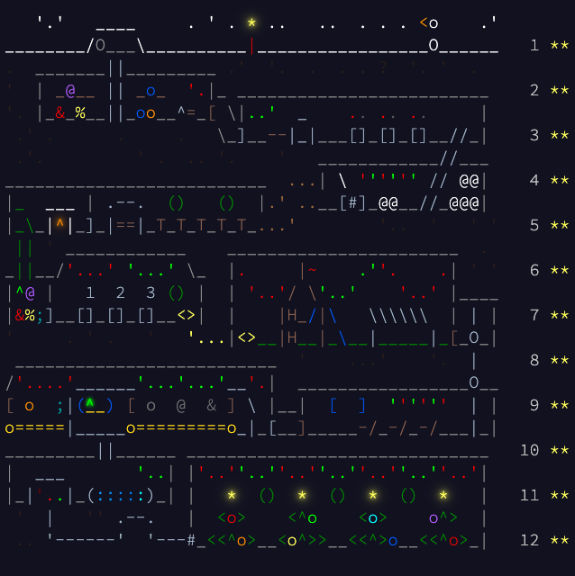

# adventofcode2025
[Advent of Code 2025](https://adventofcode.com/2025) in Rust



Hats off to **Eric Wastl** for an excellent 12 days of puzzles!

## Usage

```console
$ cargo run --release -- [OPTIONS] --day <DAY>
```

or 

```console
$ cargo build --release
$ ./target/release/adventofcode2025 [OPTIONS] --day <DAY>
```

```console
Options:
  -d, --day <DAY>     Puzzle day to run
  -i, --input <PATH>  Path to input file
  -h, --help          Print help
```

If no `--input` flag is passed, the default input file path of `./data/day[#]/input.txt` will be used for the given day.